# Budget Planner

**A calm budget that lives on your phone.**

A case study from **Break and Build** · Mobile-first personal finance · React Native (Expo) · v1 designed and built in ~4 weeks · Public launch May 2026.

---

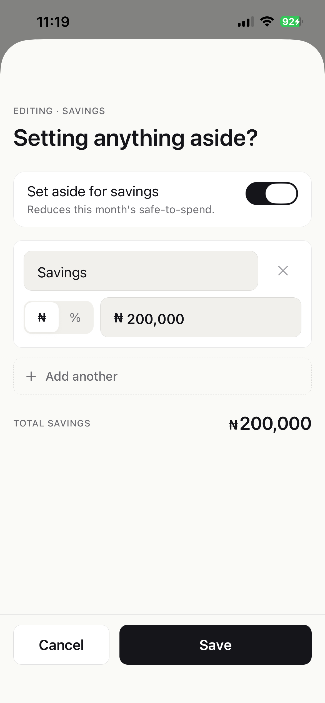

---

## TL;DR

|   |   |
|:---|:---|
| 🎯 **Problem** | Most people make a budget on the 1st and forget about it. |
| 💡 **Solution** | A mobile-first tracker that turns a planning worksheet into a daily rhythm. |
| 🎨 **Aesthetic** | "Apple-Wallet calm" — quiet, premium, no streaks, no mascots, no gradients. |
| 🛠️ **Stack** | React Native (Expo SDK 54) · TypeScript · AsyncStorage today, Supabase next · Poppins · indigo brand `#5046E6`. |
| 📦 **What shipped in v1** | 11 screens, 25 components, 5 design artifacts, 1 design system, 0 hardcoded colors outside the tokens. |
| 🚀 **Status** | TestFlight beta in ~2 weeks. Public launch shortly after. |

---

## The problem, in the user's own words

> *"I make a budget at the start of the month and then forget about it. Two weeks in, I have no idea whether I'm on track. The plan and my real spending drift apart silently until the end of the month, when I either feel vague guilt or pretend it didn't happen."*

Most budget apps fall into one of two camps:

| Camp | Examples | What's wrong with it |
|---|---|---|
| **Enthusiastic fintech** | Mint, Cleo, Copilot Money | Bright colors, streaks, push spam. Reads like a friend with too much caffeine. |
| **Power-user dashboards** | YNAB, Lunch Money | Beautifully dense. Punishing if you're not already a budget nerd. |

We wanted **neither**. A budget that lives in your pocket. Quiet, trustworthy, disciplined enough to do less.

---

## The process

Instead of opening Figma and pushing pixels, we worked through **a six-phase design flow.** Each phase produces a deliverable that feeds the next.

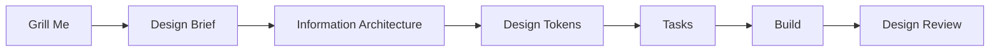

| Phase | Deliverable |
|---|---|
| 🔥 **Grill Me** | Shared understanding — no file. Pressure-tests every decision branch. |
| 📋 **Design Brief** | [`DESIGN_BRIEF.md`](./DESIGN_BRIEF.md) — problem, principles, aesthetic, out-of-scope. |
| 🗂️ **IA** | [`INFORMATION_ARCHITECTURE.md`](./INFORMATION_ARCHITECTURE.md) — site map, 7 user flows, naming. |
| 🎨 **Tokens** | [`DESIGN_TOKENS.md`](./DESIGN_TOKENS.md) + typed TS source. |
| 🧱 **Tasks** | [`TASKS.md`](./TASKS.md) — 25 vertical-slice tasks, dependency-ordered. |
| 🔍 **Review** | [`DESIGN_REVIEW.md`](./DESIGN_REVIEW.md) — code-level audit against the brief. |

The rule: **a phase can't start until the previous one has settled.** No tokens until we know the aesthetic. No tasks until we know the IA. The flow makes it harder to skip the hard thinking — and easier for a future team to read why every screen looks the way it does.

---

## The four decisions that shaped the product

### 1. Local-only, no account, no backend

<table>
<tr>
<td width="60%">

Branch 6 of the grill phase: *how should data be stored?*

We picked: **AsyncStorage on the device. Zero friction to start.**

Personal-finance apps die when users see a signup form before they've seen any value. The first 10 seconds had to be: open app → currency picker → setup → home screen. **No account, no email, no password.** The data lives on the device.

> *Cloud sync ships as **optional** in v1.0 (planned via Supabase + anonymous auth). It is never required.*

</td>
<td>

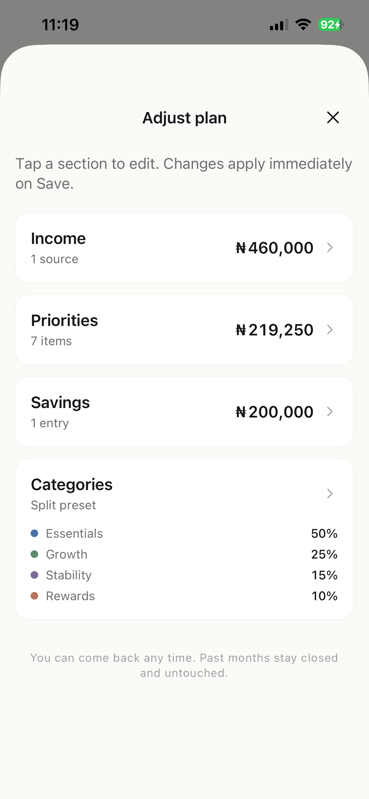

</td>
</tr>
</table>

### 2. One screen, one answer

<table>
<tr>
<td>

</td>
<td width="60%">

The second of our three experience principles:

> *Every screen exists to answer one question. If a screen tries to answer two questions, it gets split.*

Most fintech home screens try to answer six questions at once. Ours answers one: **today's safe-to-spend.** The hero numeral is impossible to miss. Below it, the four category bars answer "what's left in each bucket?" Below those, recent activity answers "did the last thing I logged go in?"

That's it. No watchlist. No insights chart. No marketing card.

</td>
</tr>
</table>

### 3. Manual logging, not bank sync

<table>
<tr>
<td width="60%">

The hardest trade-off. Bank sync (Plaid, Mono) is what fintech users *expect* — auto-import, no manual entry.

But it carries hidden costs: a backend, recurring API fees, security responsibility for users' bank credentials, and a category-mapping problem that's only ever 80% right.

We chose **manual logging with friction-killing UX**:

- Tap the FAB anywhere
- Amount field auto-focuses, number-pad open
- Last-used category pre-selected
- Optional note
- Tap *Log*

**Brief target: 5 seconds. We ship at ~3.**

</td>
<td>

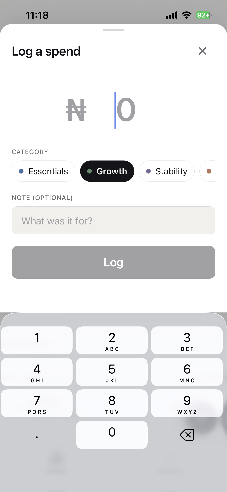

</td>
</tr>
</table>

### 4. Apple-Wallet calm

<table>
<tr>
<td>

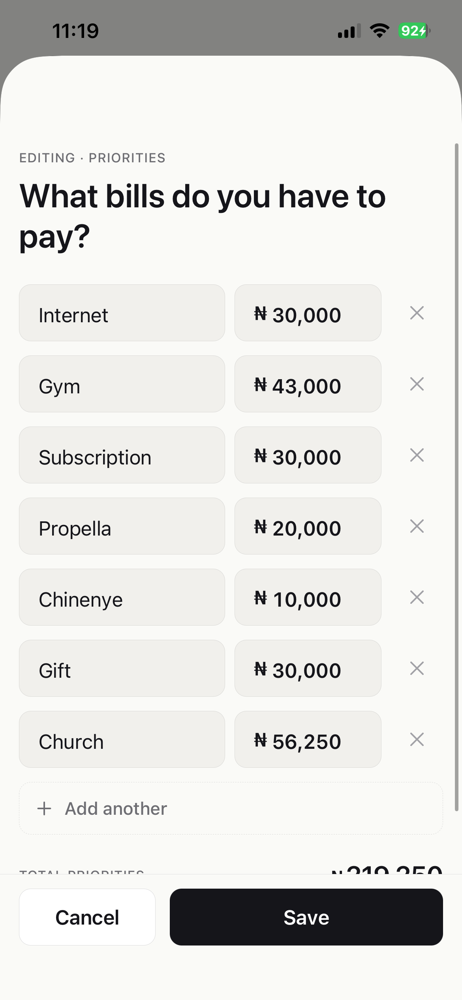

</td>
<td width="60%">

We named the references explicitly in the brief — Apple Wallet, Apple Money, Things 3.

And the **anti-references** just as explicitly:

> Anything with a streak counter, gamification, mascots, or a chart with more than two colors is out.

Concretely:

- Warm cream `#FAFAF7` background (deliberately not pure white)
- Near-black ink `#15151A` (warmer than pure black on a warm bg)
- Four desaturated category accents at equal perceived lightness
- Generous whitespace, hairline borders
- System font with tabular numerals
- **No illustrations**

The interface should look *expensive* because it is mostly **empty**.

</td>
</tr>
</table>

---

## Inside the system

A few execution choices that mattered:

<table>
<tr>
<td width="50%">

### 🎨 Tokens ship in code, not Figma

Every spacing value, type style, color, border radius, shadow, and motion timing lives in `apps/mobile/src/theme/tokens.ts` as a typed TypeScript export. Components import from it; nothing is hardcoded.

We audited at the end of v1 — **one hardcoded hex across ~35 files.** When dark mode lands, the swap is one line. No component rewrites.

</td>
<td width="50%">

### 📐 Math shared across platforms

Income, priorities, savings, the 50/25/15/10 split, the safe-to-spend formula — all live in a shared `@budgetplanner/core` package.

Consumed by the mobile app today. Could ship to web tomorrow. A different team could build a native iOS port consuming the same logic.

</td>
</tr>
<tr>
<td>

### 🛡️ Defensive persistence

The data model already has one schema bump in it. `parseBudgetBlob` and `migrateV1ToV2` handle the lift defensively — corrupt JSON, missing fields, or legacy shapes never throw.

**The app cannot crash on a storage edge case.**

</td>
<td>

### 📊 One chart, on purpose

The brief allowed *"no chart heavier than a thin progress arc."* We took it literally.

One mini arc on CategoryDetail. It encodes two things at once: filled portion = spend ratio, small tick = today's position in the month.

Glance → "am I on pace?" — without verbose copy.

</td>
</tr>
</table>

---

## The pivot

**Three weeks in, after living with the app on a real device, the founder said:**

> *"I want to add a bit of color. Can we do something more like Coinbase?"*

This was a real test. The brief was explicit — **"Monochrome surface. Category accent colors appear only on the category bar fills"** — and we'd held the line for the entire build.

Two options:

| Option | What it means |
|---|---|
| 🚫 **Push back** | "The brief was right, give it more time." |
| ✅ **Absorb the feedback** | Adjust, document the shift honestly. |

We chose the second. In a **4-hour phase**, the visual identity shifted:

| Surface | Before (calm) | After (brand) |
|---|---|---|
| Primary buttons | Ink `#15151A` | **Indigo `#5046E6`** |
| FAB | Ink | **Indigo** |
| Active tab icon + label | Ink | **Indigo** |
| Section links | Gray | **Indigo** |
| Filter chips (selected) | Ink-filled pill | **Light-indigo tinted pill** |
| Type system | System font | **Poppins** (full weight ladder) |
| App icon + splash | Default | **Custom logo** |
| Category accents (the 4 buckets) | Muted | *Unchanged — they're functional, not brand* |

The Apple-Wallet-calm **structure** stays — generous whitespace, tabular numerals, hairline separators, no illustrations. The **identity** is now distinctly the team's own.

> **The lesson:** Calm was the right starting point. Building with that constraint kept us from drowning the product in personality during initial development. Adding brand color *after* the structure was solid was a 4-hour change. Trying to design with brand color from day one would have produced a busier, more conventional fintech app.

---

## What still needs to happen

- 🔄 **Cloud sync** (Supabase + anonymous auth) — paused for a paid project setup, then ~1 week of work
- 🔔 **Push notifications** — shipped in v1.0. Two only, both local, opt-in
- 📝 **Brief rewrite** — current `DESIGN_BRIEF.md` describes the original calm aesthetic; needs an update reflecting the brand pivot
- 📲 **TestFlight beta** — small invited group first
- 🏬 **App Store + Play Store** — submission after beta feedback

**Explicitly deferred to v1.1**: iOS home-screen widget, Apple Watch companion, receipt OCR (on-device Vision Kit), subscription auto-detector. Each would change how users use the app. **v1 has to be good first.**

---

## What we'd carry into the next project

> **1.** The grill phase is the cheapest hour of any project. Resolving 8 foundational decisions before any design work began saved weeks downstream.

> **2.** Tokens in code beat tokens in Figma. When a designer renames a token and it propagates to the build, the "design vs. dev sync" problem disappears.

> **3.** Naming is a design surface. *"Transaction" not "expense." "Close out" not "wrap up." "Adjust plan" not "edit budget."* These decisions live in the IA doc and they're load-bearing.

> **4.** The brief should be a contract you're willing to break. We held the monochrome line for the full build, then broke it deliberately when feedback said to. A brief that's never revisited is one that's secretly being ignored.

> **5.** Restraint is the differentiator. Two notifications, ever. No streaks. No gamification. No social. Almost every product instinct in personal finance pushes toward *more*. **Less is what makes this readable.**

---

## More from the build

<table>
<tr>
<td>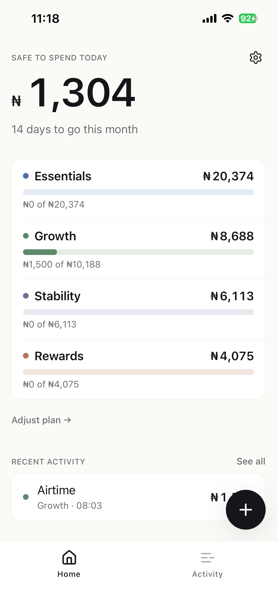</td>
<td>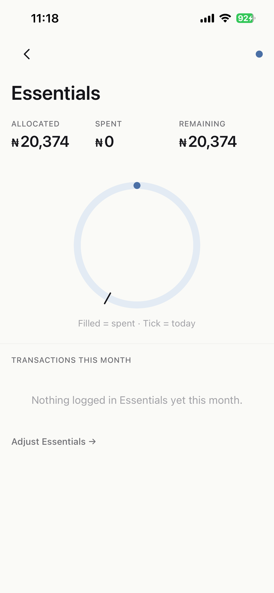</td>
<td>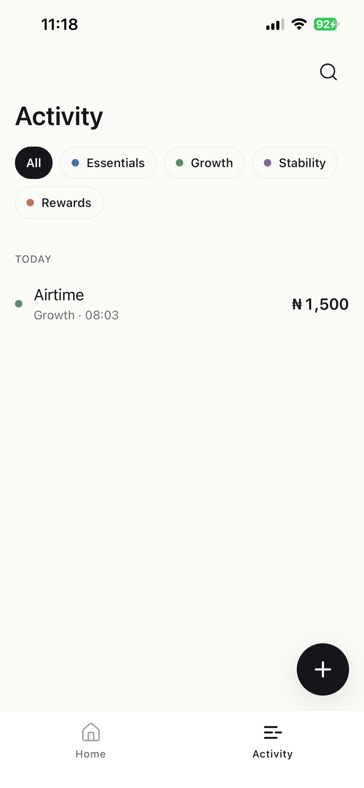</td>
</tr>
<tr>
<td align="center"><em>Home, no transactions yet</em></td>
<td align="center"><em>Activity feed</em></td>
<td align="center"><em>Adjust-plan hub</em></td>
</tr>
<tr>
<td>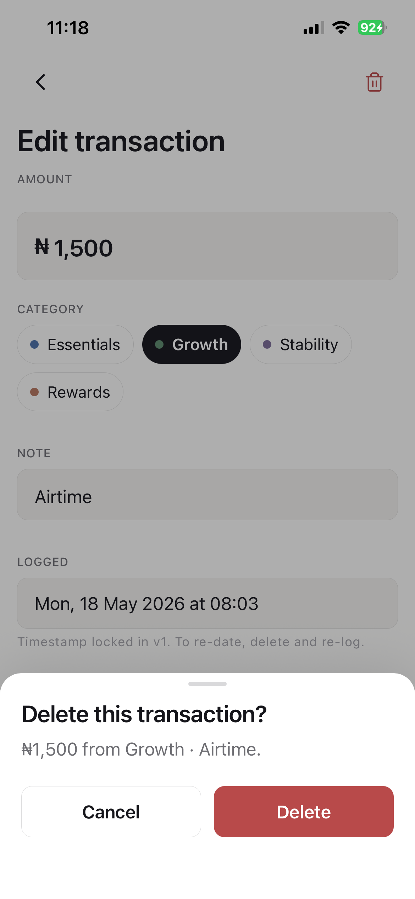</td>
<td>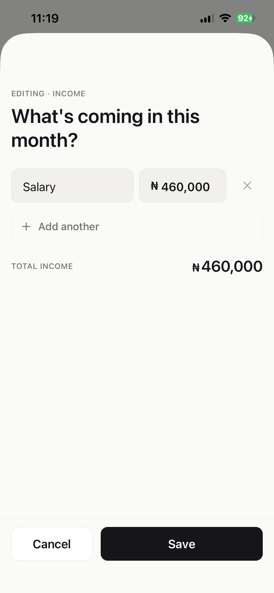</td>
<td>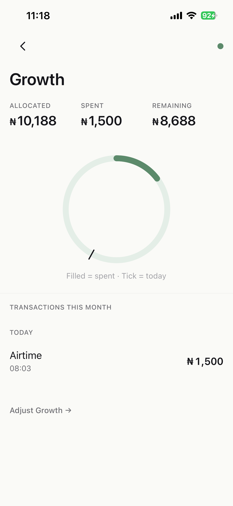</td>
</tr>
<tr>
<td align="center"><em>Edit + delete a transaction</em></td>
<td align="center"><em>Setup · category split</em></td>
<td align="center"><em>Setup · income</em></td>
</tr>
</table>

---

## Artifacts

The full design trail is in [`.design/budget-tracker-mobile-v1/`](./):

- 📋 [`DESIGN_BRIEF.md`](./DESIGN_BRIEF.md)
- 🗂️ [`INFORMATION_ARCHITECTURE.md`](./INFORMATION_ARCHITECTURE.md)
- 🎨 [`DESIGN_TOKENS.md`](./DESIGN_TOKENS.md)
- 🧱 [`TASKS.md`](./TASKS.md)
- 🔍 [`DESIGN_REVIEW.md`](./DESIGN_REVIEW.md)
- 📸 [`screenshots/`](./screenshots/) — 12 real-device captures

Code lives at [`apps/mobile/`](../../apps/mobile/) and [`packages/core/`](../../packages/core/).

---

**Break and Build** · 2026

*If you'd like to work with us on something similar — that's the deliverable. Not just the app, but the reasoning behind every decision in it.*

